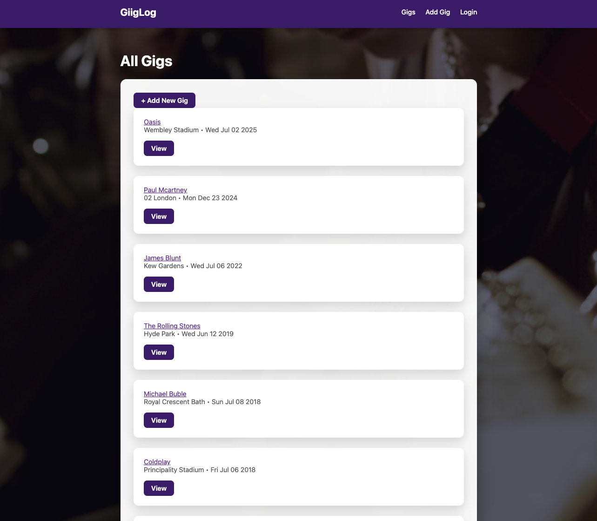
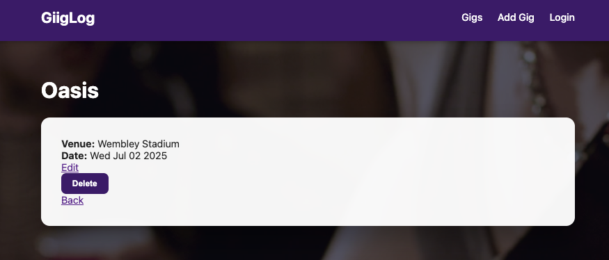
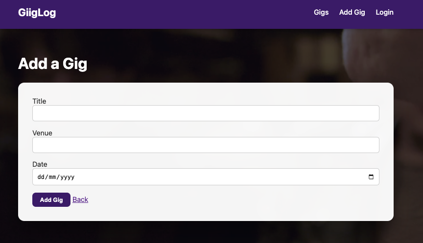
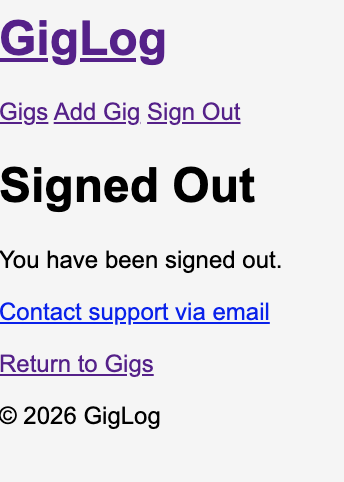
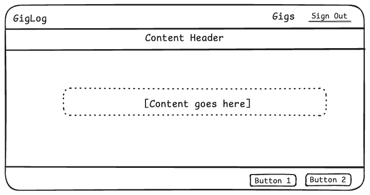

# GigLog

GigLog is a MEN-stack CRUD application for tracking live music gigs.

## Description
Users can view, add, edit, and delete gigs they have attended, including artist name, venue, and date.

This project was built as part of a coursework submission using:
- MongoDB
- Express
- Node.js
- EJS

## Getting Started

### Prerequisites
- Node.js
- MongoDB Atlas connection string

## Features

- User authentication (sign up, login, sign out)
- Create new gigs with artist, venue, city, date, and notes
- View a list of all gigs
- View individual gig details
- Edit existing gigs
- Delete gigs
- Each gig is associated with a user

## Screenshots

### GigLog Home

### All Gigs / Show Gig

### Add New Gig

### Sign Out

### ERD

### Wireframe

## Technologies Used
- Node.js
- Express
- MongoDB Atlas
- Mongoose
- EJS
- CSS

