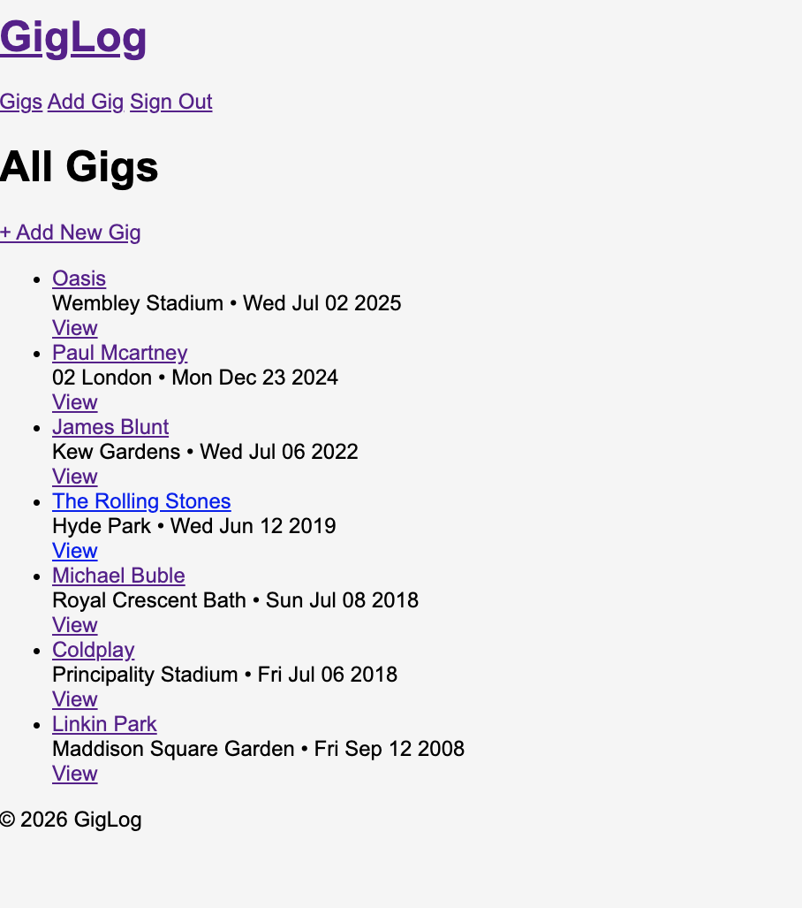
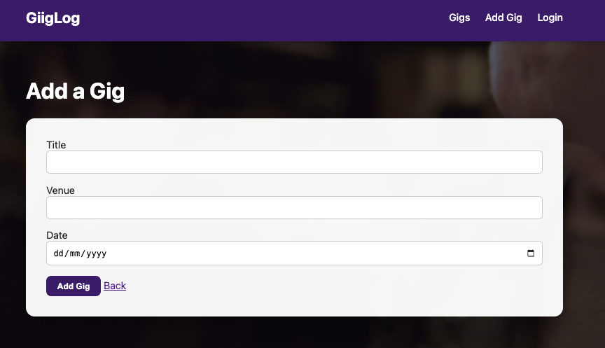
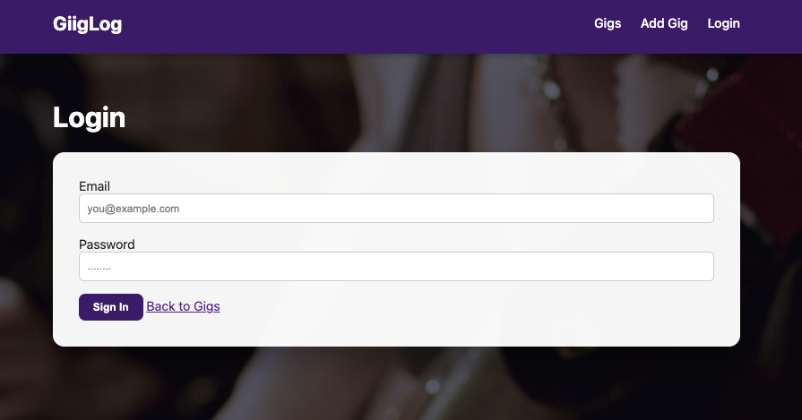
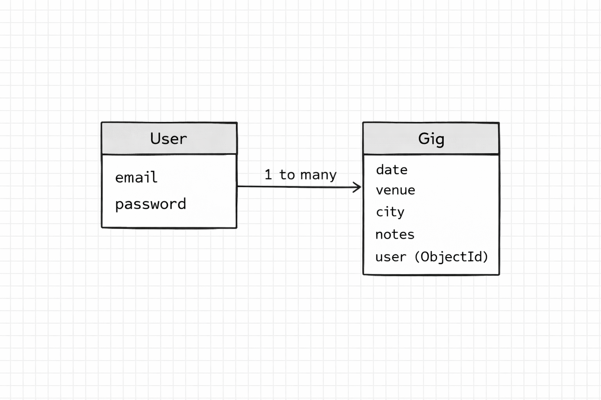
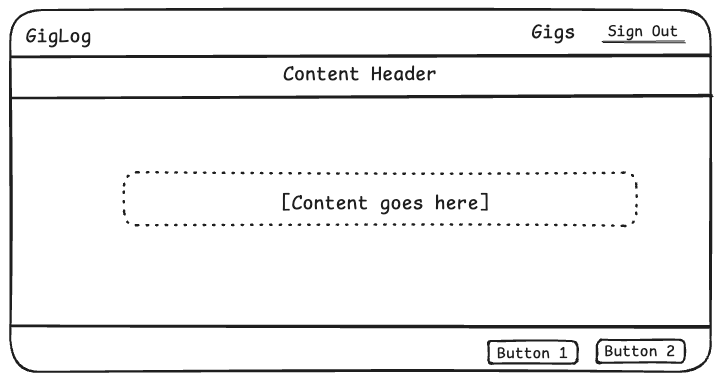

# 🎵 GigLog – Personal Live Music Journal

A full-stack web application that enables music fans to create a personal digital journal of every live performance they've attended.

Built using the MEN stack (MongoDB, Express.js and Node.js), GigLog allows users to securely record, organise and revisit concerts they've experienced, creating a permanent history of their live music journey.

---

## 🚀 Live Demo

🌐 https://giiglog-9baf058f53ab.herokuapp.com/gigs

---

## 📸 Application Preview

### Home Page



### Gig Details


### Add New Gig



### Login



---

# ✨ Features

- 🔐 Secure user authentication
- 🎵 Create, edit and delete gig entries
- 📍 Record artist, venue and concert date
- 👤 Individual user accounts
- 💾 Persistent MongoDB database
- 📱 Responsive interface
- ⚡ RESTful routing
- 🖥 Server-side rendering with EJS

---

# 💡 Project Overview

As both a software engineer and musician, I've attended hundreds of live performances over the years. I wanted to build an application that allows music fans to keep a permanent digital journal of every concert they've attended.

GigLog combines my passion for software engineering with my background in live music, demonstrating how technology can solve real-world problems for users while showcasing full-stack web development using JavaScript and the MEN stack.

---

# 🛠 Tech Stack

| Category | Technologies |
|------------|-------------|
| Front End | HTML5, CSS3, EJS |
| Back End | Node.js, Express.js |
| Database | MongoDB Atlas |
| ODM | Mongoose |
| Authentication | Express Sessions |
| Deployment | Heroku |
| Version Control | Git & GitHub |

---

# 🏗 Architecture

The application follows the MVC (Model–View–Controller) architecture to separate business logic, routing and presentation.

```
Browser
      │
      ▼
Express Routes
      │
      ▼
Controllers
      │
      ▼
Models (Mongoose)
      │
      ▼
MongoDB Atlas
```

---

# 🗄 Database Design

Each registered user owns multiple Gig entries, allowing every user to manage their own private concert history.

### Entity Relationship Diagram



---

# 🎨 Planning

Wireframes were created before development to plan the application layout and user journey.



---

# 📂 Project Structure

```
giglog/

├── config/
├── controllers/
├── middleware/
├── models/
├── public/
├── routes/
├── views/
├── server.js
├── package.json
└── README.md
```

---

# ⚙️ Installation

Clone the repository

```bash
git clone https://github.com/tomrhysjones/giglog.git
```

Navigate into the project

```bash
cd giglog
```

Install dependencies

```bash
npm install
```

Create a `.env` file

```env
MONGODB_URI=your_database_connection

SESSION_SECRET=your_session_secret
```

Run the application

```bash
npm run dev
```

Open

```
http://localhost:3000
```

---

# 📚 What I Learned

Developing GigLog strengthened my understanding of:

- Full-stack JavaScript development
- RESTful application design
- MongoDB data modelling
- MVC architecture
- User authentication
- Session management
- CRUD operations
- Express routing
- Git & GitHub workflows
- Deploying production applications

---

# 🔮 Future Improvements

- Spotify API integration
- Google Maps venue integration
- Artist images
- Search and filtering
- Concert statistics dashboard
- Favourite artists
- Image uploads
- Mobile application
- Dark mode

---

# 👨‍💻 Author

**Tom Rhys Jones**

Full-Stack Software Engineer

🌐 Portfolio (Coming Soon)

GitHub:
https://github.com/tomrhysjones

LinkedIn:
https://www.linkedin.com/in/tom-rhys-jones-63b553209/

---

⭐ Thank you for taking the time to view this project. Feedback is always welcome.

